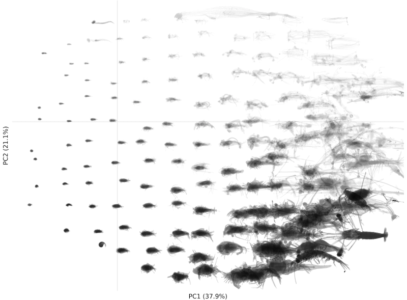

# morphr

R package to describe morphological variations and create "morphotypes" from greyscale images.

## Installation

`morphr` is not on CRAN (yet), you need to install it from this github repository. It contains Fortran code which needs to be compiled. This requires the `gfortran` compiler which can be installed with your package manager on Linux, from [R Tools for Mac](https://mac.r-project.org/tools/) or via [Homebrew](https://brew.sh) on macOS, and from [RTools](https://cran.r-project.org/bin/windows/Rtools/) on Windows. Once `gfortran` is installed, issue the following command in R

```
remotes::install_github("jiho/morphr")
```

## Usage

Use `img_read()` and `img_show()` to read and display images, as well as other functions starting with `img_` to manipulate them or compute properties from them.

Use `morphospace()` to create a morphological space, i.e. a description of the morphological features of the images on a n-dimensional space, through a Principal Component Analysis. Optionally, but frequently, use `mask_extreme()` to remove extreme values and the `yeo_johnson()` transformation to make the distributions of each variable more Gaussian-looking before the PCA.

Use `morph()` to "morph" (i.e. fuse) several images into one, which is representative of the original batch of images.

Use `ggimg_grid()` to display several images and `ggmorph_radial()`, `ggmorph_tile()` to describe a morphological space by displaying such morphs at regular locations in that space. Each of those high level functions allow to perform arbitrary pre-processing on the input images to chop some parts, contrast them, rotate them, etc. on the fly.



*Two first axes of a morphospace for planktonic organisms, with larger organisms on the right and darker organisms at the bottom.*